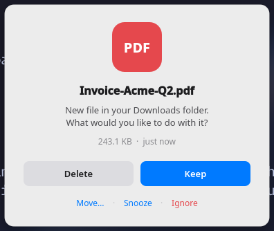
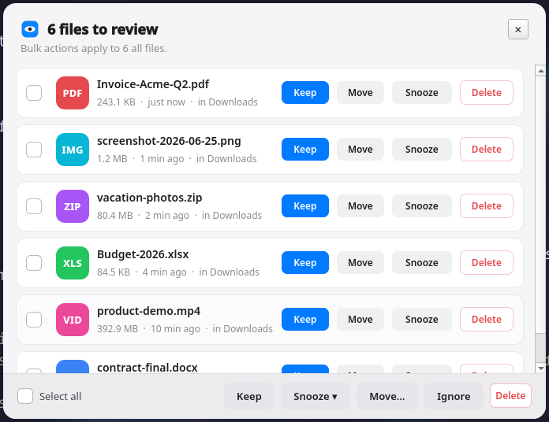
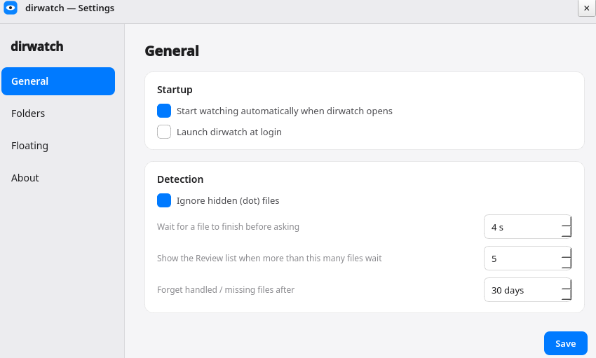

<p align="center">
  
</p>

<h1 align="center">dirwatch</h1>

<p align="center">
  A smart directory watcher for Linux. When a new file lands in a folder you
  watch, a floating macOS-style card asks what to do with it.
</p>

<p align="center">
  <a href="https://github.com/hamidlabs/dirwatch/releases/latest">
    
  </a>
  
  
</p>

<p align="center">
  
</p>

Point it at folders that grow on their own (your Downloads folder, a screenshots
folder, a scanner inbox) and whenever a new file settles, you get one card:

- **Keep** — leave it, never ask again
- **Move…** — file it into another folder
- **Snooze** — ask again in 1 hour / this evening / tomorrow / next week
- **Delete** — send it to the Trash (recoverable)
- **Ignore** — like Keep, for clutter you want to stop seeing

It lives in the system tray. Existing files in a folder are baselined (not
prompted) when you first add it, so you only get asked about genuinely new
arrivals. Decisions are remembered in a local SQLite database, so nothing is
prompted twice, and snoozes survive a restart.

## Screenshots

When several files pile up (for example after the machine was off through a few
snoozes), dirwatch shows a single **Review** window instead of a stack of cards:

<p align="center">
  
</p>

A clean settings window for folders and behavior:

<p align="center">
  
</p>

## Highlights

- **Floating card, not a tiled window.** On tiling Wayland compositors (niri,
  sway, hyprland) dirwatch detects the compositor and self-configures a floating
  rule (with a backup of your config). On GNOME/KDE it just works.
- **Backlog-aware.** One or two files → individual cards. A pile of files (e.g.
  after the machine was off through several snoozes) → a single **Review** window
  listing everything, with per-file actions and bulk super-actions
  (Keep all / Snooze all / Move all / Ignore all / Delete all).
- **Robust.** Snoozed files are excluded from new-file prompts and each wakes on
  its own schedule. A file deleted from the file manager while snoozed is quietly
  dropped, never shown, never crashes. Old handled/missing records are pruned.

## Install

### AppImage (no Python needed)

Download `dirwatch-x86_64.AppImage`, then:

```sh
chmod +x dirwatch-x86_64.AppImage
./dirwatch-x86_64.AppImage
```

To build it yourself:

```sh
make appimage      # produces dist/dirwatch-x86_64.AppImage
```

### From source (developers)

```sh
make venv          # create .venv and install editable + deps
make run           # launch
make test          # headless smoke tests
```

### Local system install (pip + desktop entry)

```sh
make install       # pip install --user + .desktop + icon into ~/.local
dirwatch           # now on your PATH and in the app menu
make uninstall     # remove the desktop entry, icon and autostart
```

## Configure

Tray menu → **Settings…**:

- **General** — start watching on launch, launch at login, ignore hidden files,
  settle delay, the Review-window threshold, and how long to remember decisions.
- **Folders** — add/remove/enable watched folders.
- **Floating** — see the detected compositor and enable/disable the floating rule.
- **About** — version and where your config/database live.

By default it watches `~/Downloads`.

## How it works

| Module | Role |
|--------|------|
| `watcher.py` | watchdog observer; forwards "something changed here" |
| `engine.py`  | debounce + stable-size detection, baselining, snooze waking, startup recovery, pruning |
| `db.py`      | SQLite store of items, decisions, snoozes, baselines |
| `actions.py` | keep / delete (trash) / move / snooze / ignore |
| `desktop.py` | detect compositor, self-configure floating |
| `autostart.py` | launch-on-login XDG entry |
| `ui/`        | tray app, the triage card, the Review window, settings |

A file is only offered once its size has stayed unchanged for a few seconds
(`debounce_seconds`), so in-progress downloads (`.crdownload`, `.part`, …) are
skipped until they finish.

## Requirements

- Linux desktop with a system tray
- Python 3.11+ (only for source/`make` installs; the AppImage bundles its own)
